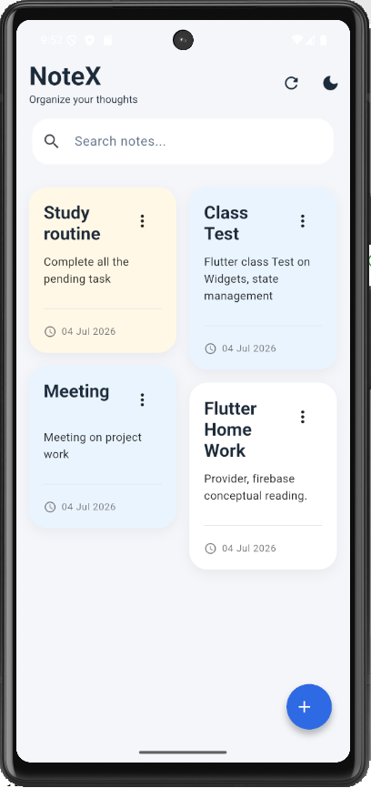
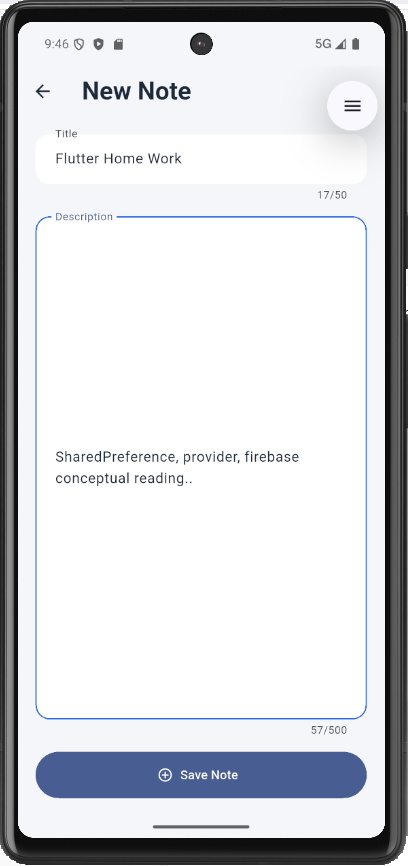
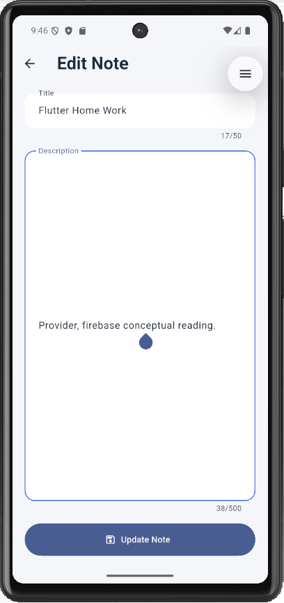
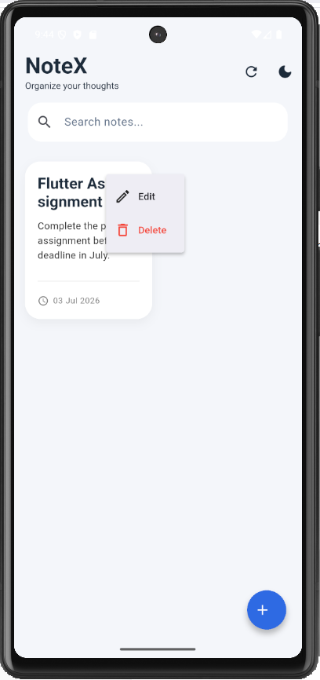
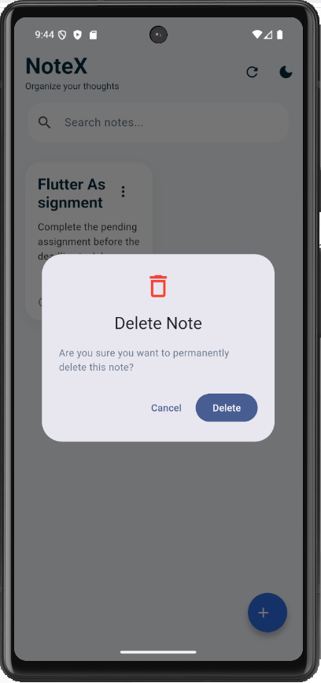
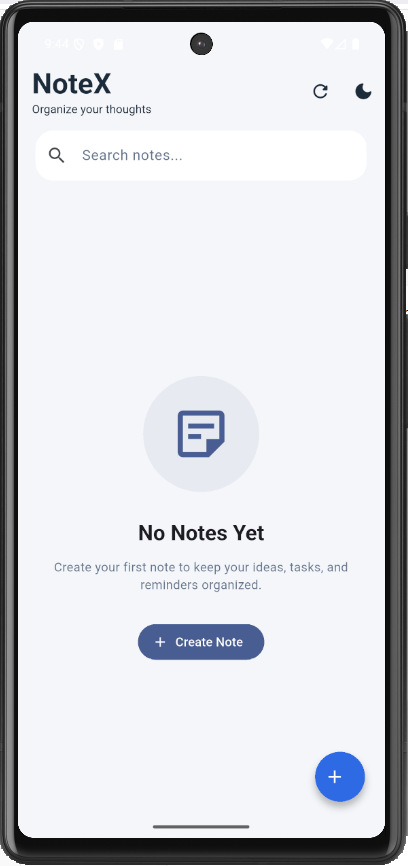

# Notes Management App

A modern **Flutter Notes Management Application** built with **Firebase Cloud Firestore** and **Provider State Management**. This application allows users to create, read, update, delete and search notes with a clean Material 3 user interface.

# 📸 Screenshots

| Home | Add Note | Edit Note |
|------|----------|-----------|
|  |  |  |
| Delete Note 1 | Delete Note 1 | Empty State |
|------|----------|-----------|
|  |  |  |


# Features

- Create new notes
- View all notes
- Update existing notes
- Delete notes
- Search notes instantly
- Notes sorted by latest updated date


## Modern UI

- Material 3 Design
- Responsive Layout
- Masonry Grid View
- Beautiful Note Cards
- Empty State UI
- Floating Action Button
- Dark / Light Theme Support
- Hero Animation
- Smooth Material Animations


## Firebase

- Firebase Core
- Cloud Firestore
- Real-time Database Operations
- Firestore CRUD
- Timestamp Based Sorting


## State Management

- Provider
- Clean Architecture
- Separation of Concerns
- Reusable Widgets


#  Screens

- Home Screen
- Add Note Screen
- Edit Note Screen
- Delete Confirmation Dialog
- Empty State Screen


# Project Structure

lib
│
├── core
│   └── theme
│       └── app_theme.dart
│
├── models
│   └── note_model.dart
│
├── providers
│   ├── note_provider.dart
│   └── theme_provider.dart
│
├── services
│   └── firestore_service.dart
│
├── screens
│   ├── notes
│   │   └── notes_screen.dart
│   │
│   └── add_edit
│       └── add_edit_note_screen.dart
│
├── widgets
│   ├── note_card.dart
│   ├── search_bar_widget.dart
│   └── empty_notes_widget.dart
│
├── utils
│   └── validators.dart
│
├── firebase_options.dart
│
└── main.dart


#  Tech Stack

| Technology | Usage |
|------------|-------|
| Flutter | UI Development |
| Dart | Programming Language |
| Firebase | Backend |
| Cloud Firestore | Database |
| Provider | State Management |
| Material 3 | UI Design |
| flutter_staggered_grid_view | Masonry Grid |
| intl | Date Formatting |


# Packages Used

firebase_core
cloud_firestore
provider
intl
flutter_staggered_grid_view


# Firebase Features

- Firebase Initialization
- Cloud Firestore Integration
- Create Document
- Read Documents
- Update Document
- Delete Document
- Timestamp Ordering


#  Installation

### Clone Repository

```bash
git clone https://github.com/sazia006/note_management_app.git
```


### Open Project

```bash
cd note_management_app
```

### Install Packages

```bash
flutter pub get
```

### Configure Firebase

Download

```
google-services.json
```

Place it inside

```
android/app/
```

---

### Run Project

```bash
flutter run
```

---

#  How to Use

### Create Note

- Tap **+** icon
- Enter Title
- Enter Description
- Save


### Update Note

- Tap on any note
- Modify information
- Press Update


### Delete Note

- Tap **Three Dot** icon
- Tap Delete
- Confirm


### Search Note

- Type in the Search Bar
- Notes filter instantly


# Future Improvements

- Firebase Authentication
- Favorite Notes
- Categories
- Offline Support
- Cloud Backup
- Pin Notes
- Reminder Notifications
- Rich Text Editor


# Developer

**Sazia Sultana Shammi**

Aspiring Flutter Developer

GitHub:
https://github.com/sazia006

